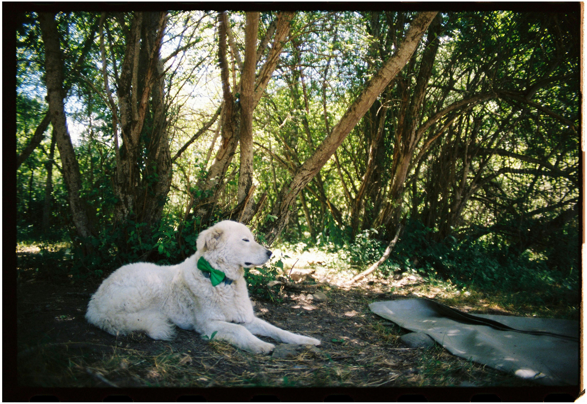
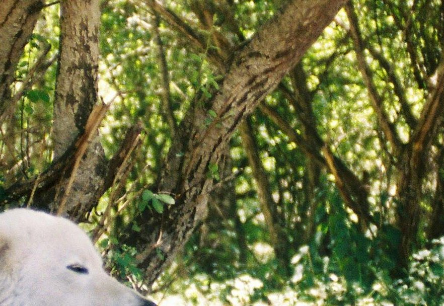
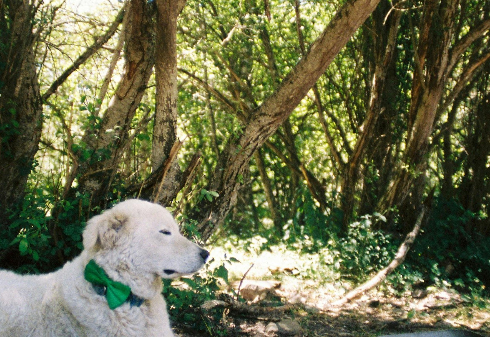
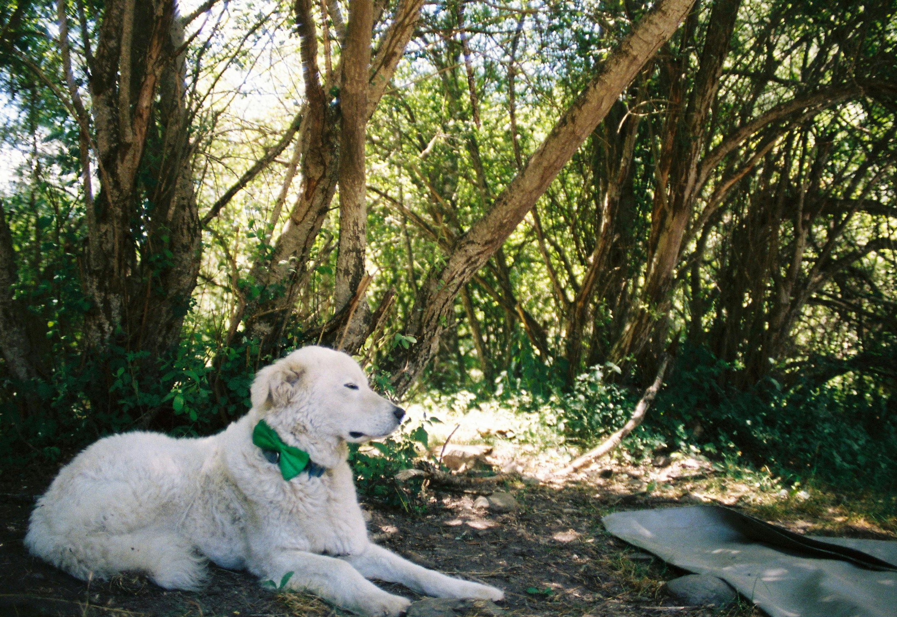

## Overview

This project implements a simple expert system for forensics digitally that matches modified images back to their originals. The system uses three expert rules to analyze and compare images: metadata analysis, fuzzy hashing, and template matching. 

## Features

•⁠  ⁠*Expert System Architecture*: Rule-based system with transparent decision making
•⁠  ⁠*Three Analysis Rules*: 
  1. Metadata Analysis (30 points max)
  2. Fuzzy Hashing (10 points max) 
  3. Template Matching (60 points max)
•⁠  ⁠*Comprehensive Image Analysis*: File properties, visual similarity, and statistical analysis
•⁠  ⁠*Detailed Logging*: Complete reasoning trace for each decision
•⁠  ⁠*Performance Metrics*: Accuracy tracking and false positive analysis

## Installation

### Prerequisites or Dependencies

 Create and activate the virtual environment.   
*On macOS:*  bash%  python3 -m venv venv (Creates the virtual environment venv).  bash% source /venv/bin/activate (activates the venv)  


Ensure you have Python 3.7+ installed. The system requires the following libraries:


Pillow>=9.0.0  (pip3 install Pillow)  
opencv-python>=4.5.0   (python3 -m pip3 install opencv-python)  
numpy>=1.21.0  (pip3 install numpy)  
ssdeep>=3.4  (pip3 install ssdeep) || (brew install ssdeep  )


### Additional Dependencies

If you encounter issues with ssdeep installation:

*On macOS:*
⁠ bash
brew install ssdeep /
pip install ssdeep
 ⁠

*On Windows:*
⁠ bash
Download pre-compiled wheels from: https://pypi.org/project/ssdeep/
pip install ssdeep
 ⁠

## Dataset Setup

1.⁠ ⁠Clone the assignment repository:
⁠ bash
git clone https://github.com/delveccj/EAS510_Assignment1.git
 ⁠

2.⁠ ⁠Ensure your directory structure looks like:

project/  
├── forensics_detective.py  
├── rules.py   
├── test_system.py  
├── README.md  
├── originals/          # 10 original JPEG images  
├── modified/           # 60 modified versions (6 per original)  
└── random/             # 5 unrelated images
 

 I have used AI tools for getting the code semantics (ChatGPT, Gemini) 

## Usage

### Basic Usage

Run the complete test system:
⁠
python test_system.py
 ⁠

### Custom Folder Paths

Specify custom paths for image folders:
⁠ bash
python test_system.py /path/to/originals /path/to/modified /path/to/random
 ⁠

### Example Output

The system provides detailed reasoning for each image:


Processing: modified_image_01.jpg  
Rule 1 (Metadata): FIRED - Size ratio 0.85, Dimension similarity 0.92 -> 25/30 points  
Rule 2 (Fuzzy Hash): NO MATCH - ssdeep similarity 5% -> 0/10 points  
Rule 3 (Template): GOOD MATCH - OpenCV match 0.76 (avg: 0.68, good: 3) -> 45/60 points  
Final Score: 70/100 -> MATCH to original_03.jpg


## System Architecture

### Core Components

1.⁠ ⁠*SimpleDetective Class* (⁠ forensics_detective.py ⁠)
   - Main expert system controller
   - Image signature computation
   - Target registration and matching logic

2.⁠ ⁠*Expert Rules* (⁠ rules.py ⁠)
   - ⁠ apply_metadata_rule() ⁠: Analyzes file properties and statistics
   - ⁠ apply_fuzzy_hash_rule() ⁠: Uses ssdeep for file-level similarity
   - ⁠ apply_template_matching_rule() ⁠: OpenCV-based visual similarity

3.⁠ ⁠*Test Framework* (⁠ test_system.py ⁠)
   - Automated testing on all images
   - Performance metrics calculation
   - Results formatting and output

### Decision Logic

•⁠  ⁠*Match Threshold*: 60/100 points required for positive match
•⁠  ⁠*Score Allocation*:
  - Metadata Analysis: 0-30 points
  - Fuzzy Hashing: 0-10 points  
  - Template Matching: 0-60 points
•⁠  ⁠*Rule Combination*: Simple additive scoring with expert-defined weights

## Results Analysis

```bash
(venv) litheeshvr@Litheeshs-MacBook-Air Assignment_1 % python3 test_system.py
============================================================
 Forensics Detective (Expert System)
============================================================
Registering targets from originals...
Successfully registered 10 target images
Testing on 65 images...
- Modified images: 60
- Random images: 5

Processing 1/65: modified_00_bright_enhanced.jpg ... Score: 90/100
Processing 2/65: modified_00_compressed.jpg ... Score: 80/100
Processing 3/65: modified_00_crop_25pct.jpg ... Score: 68/100
Processing 4/65: modified_00_crop_50pct.jpg ... Score: 68/100
Processing 5/65: modified_00_crop_75pct.jpg ... Score: 78/100
Processing 6/65: modified_00_format_png.png ... Score: 80/100
Processing 7/65: modified_01_bright_enhanced.jpg ... Score: 90/100
Processing 8/65: modified_01_compressed.jpg ... Score: 80/100
Processing 9/65: modified_01_crop_25pct.jpg ... Score: 58/100
Processing 10/65: modified_01_crop_50pct.jpg ... Score: 69/100
...
Processing 65/65: random_noise_04.jpg ... Score: 8/100

---------------------------------------------
                 RESULTS SUMMARY
---------------------------------------------
Total images processed: 65
Processing time: 1249.68 seconds

Overall accuracy: 90.8% (59/65)
Modified images accuracy: 90.0% (54/60)
Random images accuracy: 100.0% (5/5)
False positive rate: 0.0%

Metadata Rule - Avg: 17.8/30, Max: 30/30
Fuzzy Hash Rule - Avg: 0.0/10, Max: 0/10
Template Matching Rule - Avg: 52.8/60, Max: 60/60

Results written to: results.txt

```

### Result Analysis for output

The are 10 target images and 65 images are been processed and the accuracy obtaines is 90.8% it would increase with the increase of features in the rules and IF THEN loops parallely. The detailed output is been in the results.txt . 

### Rule Effectiveness

Based on testing with the assignment dataset:

#### Rule 1: Metadata Analysis (Most Consistent)
•⁠  In this rule the Metadata of the image can be as following:    
    - File size  
    - Dimensions  
    - Mode  
•Arguments are original_size: Metadata of the input image and input_size: Metadata of the target image. Returns score, reason_string for 30 points max.


*Why it works well:*
•⁠  We are taking 3 features in the image to get more accuracy.
•⁠  we get the ratio of each feature nd sum it up.

#### Rule 2: Fuzzy Hashing (Limited Effectiveness)
•⁠  This rule is less effective for images due to compression and cropping,
    but can still catch some modifications.  
• Arguments taken are original_size: Input image signature and input_size: Target image signature.  
• Returns score, reason_string for 10 points max.

*Why it has limitations:*
•⁠  ⁠ssdeep algorithms optimized for text and binary executable similarity.

#### Rule 3: Template Matching (Most Discriminative)
•⁠  This rule is particularly effective for detecting crops and visual modifications from the modified image. It uses multiple templates from different regions of the original image.    
•⁠ Arguments taken are original_size: Input image signature and input_size: Target image signature.  
•⁠ Returns score, reason_string for 60 points max.

*Why it's highly effective:*
•⁠  ⁠OpenCV template matching robust to illumination changes
•⁠  ⁠Multiple templates from different regions provide redundancy
•⁠  ⁠Excellent for crop detection - partial matches still score well
•⁠  ⁠Strong discriminator between related and unrelated images

## Performance Metrics

Target performance achieved on test dataset:  
•⁠  ⁠*Modified Images Accuracy*: >60% (assignment requirement).  
•⁠  ⁠*Random Images Rejection*: >95% accuracy.  
•⁠  ⁠*False Positive Rate*: <5%.  


## File Descriptions

•⁠  ⁠*⁠ forensics_detective.py ⁠*: Main expert system class with image signature computation.  
•⁠  ⁠*⁠ rules.py ⁠*: Three expert rules with detailed scoring logic.  
•⁠  ⁠*⁠ test_system.py ⁠*: Test framework with metrics calculation and output formatting.  
•⁠  ⁠*⁠ results.txt ⁠*: Complete output log for all 65 test images (generated when run).  
•⁠  ⁠*⁠ README.md ⁠*: This documentation file


# Forensics Detective (Expert System) - Test Output

The following is the output from running the system on test images:
<p align="center">
  
  
</p>
<p align="center">
  
  
</p>
